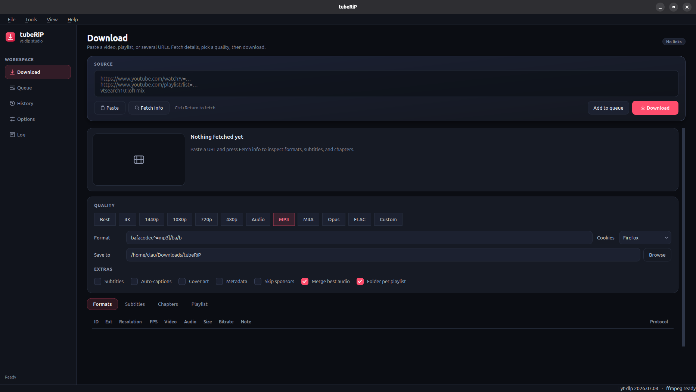

# tubeRiP

A PyQt6 desktop frontend for [yt-dlp](https://github.com/yt-dlp/yt-dlp). Paste a video, playlist, or search query, pick a quality, and download. The full yt-dlp option set is available when you need it.



## Features

- Fetch single videos, playlists, multiple URLs, and search queries such as `ytsearch10:lofi mix`
- Quality presets: Best, 4K, 1440p, 1080p, 720p, 480p, Audio, MP3, M4A, Opus, FLAC, plus a custom format string
- Format table with resolution, codecs, size, bitrate, and protocol; double-click a row to use that format
- Subtitles, auto-captions, cover art, metadata embedding, SponsorBlock, and merge-best-audio
- Download queue with progress, cancel, retry, open file, and open folder
- History of finished, cancelled, and failed jobs
- Cookies from Chrome, Chromium, Firefox, Brave, Edge, Opera, or Vivaldi
- Every yt-dlp option group (network, geo, auth, post-processing, extractors, and more), searchable from Options
- Extra CLI arguments field for anything the form does not cover
- Save and load option profiles as JSON
- Drag-and-drop URLs or URL lists onto the window
- Automatic JavaScript runtime detection (Node, Deno, Bun, QuickJS) for YouTube signature solving

## Requirements

- Python 3.10 or newer
- [ffmpeg](https://ffmpeg.org/) on `PATH` (needed to merge video plus audio and extract MP3, M4A, Opus, or FLAC)
- Network access to the sites you download from
- A JavaScript runtime (Node.js is typical) for current YouTube downloads

## Install

```bash
git clone https://github.com/ClaudiuJitea/tubeRiP.git
cd tubeRiP
python3 -m venv .venv
source .venv/bin/activate
pip install -r requirements.txt
```

On Windows, activate the venv with `.venv\Scripts\activate`.

## Run

```bash
python run.py
```

Or as a module:

```bash
python -m tuberip
```

You can pass URLs on the command line:

```bash
python run.py "https://www.youtube.com/watch?v=dQw4w9WgXcQ"
```

## Using the app

1. Paste one or more URLs and click **Fetch info** (`Ctrl+Return`), or let auto-fetch do it.
2. Choose a quality chip, or double-click a row in **Formats**.
3. Optionally enable subtitles, cover art, metadata, or sponsor skipping.
4. Click **Download** to start and switch to the queue, or **Add to queue** to stay on the Download page.

Keyboard shortcuts:

| Shortcut | Action |
| --- | --- |
| `Ctrl+Return` | Fetch info |
| `Ctrl+1` … `Ctrl+5` | Switch Download, Queue, History, Options, Log |
| `Ctrl+O` | Open a URL list file |
| `Ctrl+Q` | Quit |

Downloads default to `~/Downloads/tubeRiP`.

Open **Options** and use the search box to reach any yt-dlp flag. The extra-arguments field accepts raw CLI tokens, parsed the same way yt-dlp does.

## Project layout

```
tubeRiP/
  run.py              entry point
  requirements.txt
  pyproject.toml
  images/             screenshots used in this README
  tuberip/
    app.py            application bootstrap
    main_window.py    window, menus, drag-and-drop
    ydl.py            yt-dlp option bridge
    workers.py        fetch and download threads
    pages/            Download, Queue, History, Options, Log
    widgets/          sidebar, job cards, option form
```

## Notes

Use tubeRiP only with media you have the right to download. Site terms and copyright still apply. tubeRiP wraps yt-dlp; it does not bypass access controls beyond what yt-dlp already supports with your own cookies and credentials.
